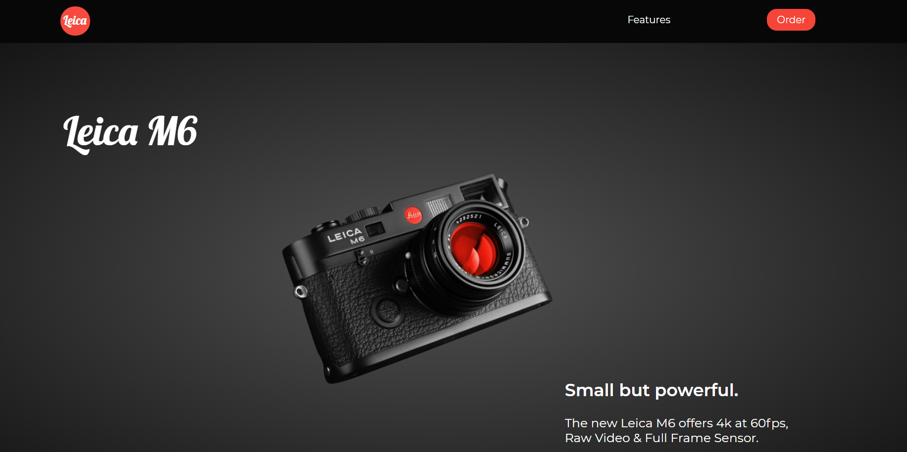

# one_ui_color

# Live Demo

<a href="https://olivares15567.github.io/one_ui_color/">Here</a>

## Installation

Clone repo: 

```bash
git clone https://github.com/Olivares15567/one_ui_color.git
```

Open html file in browser


Final Project below


