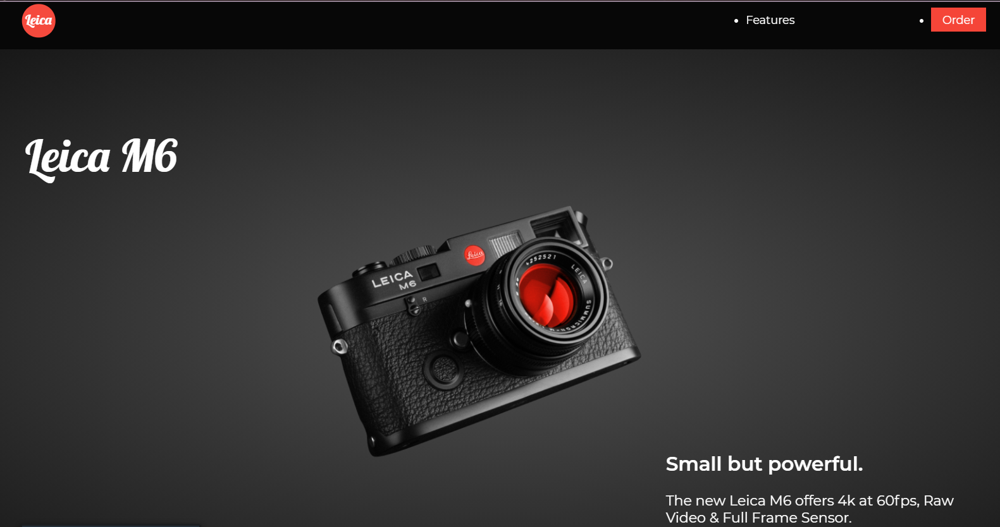

# one_ui_color

# Foobar

[Add Description]

## Installation

Clone repo: 

```bash
git clone https://github.com/Olivares15567/one_ui_color.git
```

Open html file in browser


Final Project below:

